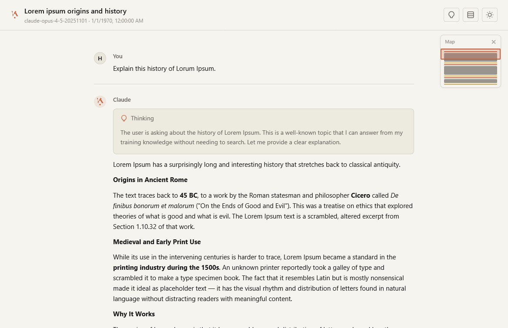

# Claude Chat Downloader

A Tampermonkey/Greasemonkey userscript that adds a **Download Chat** button to [claude.ai](https://claude.ai). It downloads the current conversation as a fully self-contained HTML file styled to match the Claude web interface.

    

## Features

- **Self-contained HTML output** no external dependencies, works completely offline
- **Dark and light mode** support with a toggle in the downloaded file
- **Syntax highlighting** for code blocks with copy-to-clipboard buttons
- **Collapsible thinking blocks** showing Claude's extended thinking
- **Artifact display** with code and preview tabs
- **Search result cards** with clickable links
- **Minimap** toggle for navigating long conversations
- **Markdown rendering** including tables, lists, blockquotes, and inline formatting
- Handles all content block types: text, thinking, tool use/results, images, code execution, and web search results

## Installation

1. Install [Tampermonkey](https://www.tampermonkey.net/) (Chrome, Edge, Firefox) or [Greasemonkey](https://www.greasespot.net/) (Firefox)
2. Click the link below to install the userscript, or create a new script in your extension and paste the contents of `claude-chat-downloader.user.js`:

   [Install claude-chat-downloader.user.js](claude-chat-downloader.user.js)

3. Navigate to [claude.ai](https://claude.ai) and open any conversation

## Usage

1. Open a conversation on claude.ai
2. Click the *Download this conversation as HTML button* in the bottom-right area of the page
3. An HTML file named after the conversation will be saved to your downloads folder
4. Open the file in any browser -- everything is embedded, no internet required